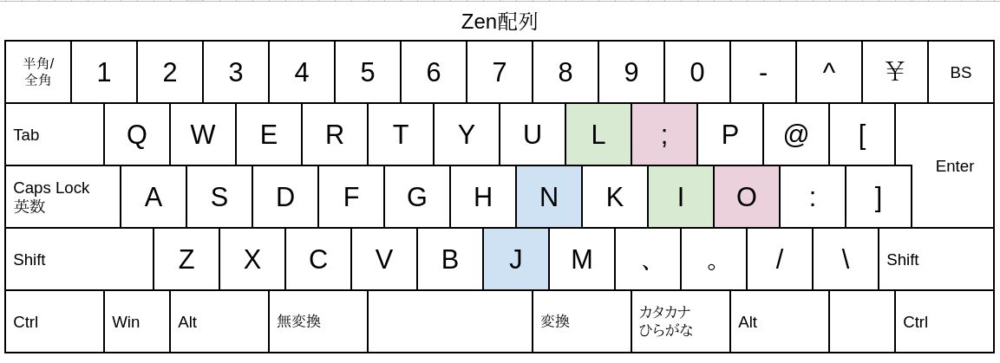

# 「Zen配列」  
Zen配列は配列沼ビギナー向けに設計されたものです。  
Minimak配列の「最小限の配列変更で、最大限の効果を得る」という設計思想に影響されたもので、入れ替えるキーは「たった３つ」で「右手だけ」です。  
ミニマリズムを追求する点で「禅（Zen）」配列と命名しました。  
  

## ・配列  

  
## ・変更するキー。  
・「N」と「J」  
日本語で頻出する文字である「ん」を打ちやすいように、ホームポジションの右手人差し指に配置しました。  
・「Ｏ」と「;」  
・「Ｉ」と「Ｌ」  
上段にある母音を右手ホームポジションに移動します。  
母音を中段に変更するだけで指の運動量が格段に減り、日本語入力が楽になります。  
・右手のホームポジションはColemak配列と互換性があるので、Zen配列で覚えたことは無駄にはなりません。  
  
## ・最後に。  
変更するキーを三つに限定したのは、「よく使う文字が、打ちやすい場所にある」ことの気持ちよさを体感してもらうためです。日本語配列を変更するというと難しく感じられますが、どの配列も「よく使う文字を、打ちやすい位置に置く」という原則に従っています。  
もっと文字入力を効率化したいと思ったら、他の日本語入力配列を調べて自分に合ったものを探してみましょう。  
私のおすすめは新JIS配列とColemak配列です。  
  
## ・参考リンク  
  
* [配列沼へのお誘い: 大岡俊彦の作品置き場](http://oookaworks.seesaa.net/article/462573246.html#gsc.tab=0)

  
